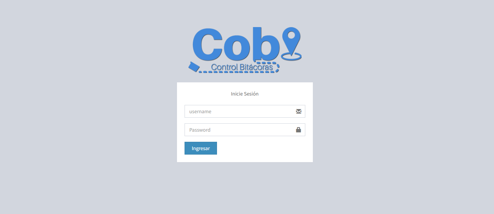
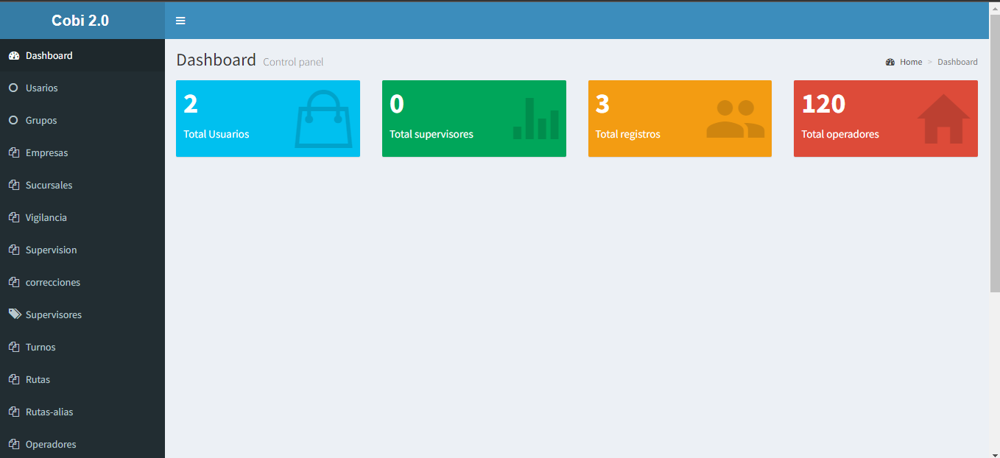

# Cobi 2.0

programa de control de bitácoras en PHP con CodeIgniter y mysql.

# Características del sistema

1.	Usuarios:
    En esta vista se pueden crear y eliminar diferentes usuarios, y asignarles su correspondiente grupo de permisos.

2.	Grupos:
    En esta sección se crean los niveles de permisos para diferentes vistas y acciones dentro del sistema.

3.	Registros de Vigilancia:
    Aquí se registra la entrada y salida de una unidad.

4.	Registros de Supervisión:
    En esta vista se agregan los tickets de los tiros de cada registro.

5.	Correcciones:
    En esta sección se realizan correcciones de los registros finalizados previamente.

6.	Perfil:
    En esta vista el usuario puede ver su información general.

7.	Tickets:
    Aquí se agrega información detallada de cada tiro realizado.

8.	Reportes:
    En esta sección se pueden filtrar los registros por fecha, unidad, etc. para obtener los registros seleccionados y exportarlos a Excel.

9.	Catálogos:

    Empresas y Sucursales: En este catálogo se puede agregar, ver y eliminar información sobre las empresas y sus sucursales.

    Supervisores: En este catálogo se puede agregar, ver y eliminar información sobre los supervisores.

    Turnos: En este catálogo se puede agregar, ver y eliminar información sobre los turnos de trabajo.

    Rutas: En este catálogo se puede agregar, ver y eliminar información sobre las rutas de las unidades.

    Alias: En este catálogo se puede agregar, ver y eliminar información sobre los alias de las unidades.

    Operadores: En este catálogo se puede agregar, ver y eliminar información sobre los operadores de las unidades.

    Recolectores: En este catálogo se puede agregar, ver y eliminar información sobre los recolectores de las unidades.

    Unidades: En este catálogo se puede agregar, ver y eliminar información sobre las unidades.

    Destino Final: En este catálogo se puede agregar, ver y eliminar información sobre los destinos finales de los residuos.

# Credenciales de administrador

email: admin
password: I8%97p

nombre base de datos: cobi
tecnoligia: MySQL

# Requisitos del servidor

PHP version 5.6 hasta 7.1.

También debería funcionar en 5.3.7, pero no se recomienda ejecutarlo en
versiones tan antiguas de PHP, debido a la seguridad, el rendimiento y potenciales
problemas, así como características que faltan.

Servidor:

Puede optar por instalar cualquiera de los siguientes servidores de aplicaciones: LAMP, MAMP, XAMMP, WAMP.

# Instalación

1. Clonar o descargar archivos. Agréguelos a su carpeta raíz si está utilizando laragon, la ubicación es "C:\laragon\www\".
2. Abra heidisql desde su servidor de aplicaciones local.
3. importe el archivo de base de datos en la carpeta C:\laragon\www\Cobi\DB
4. El programa de su sistema se encuentra en http://localhost/cobi/

# Recursos

CodeIgniter - Web Framework
AdminLTE - Theme
